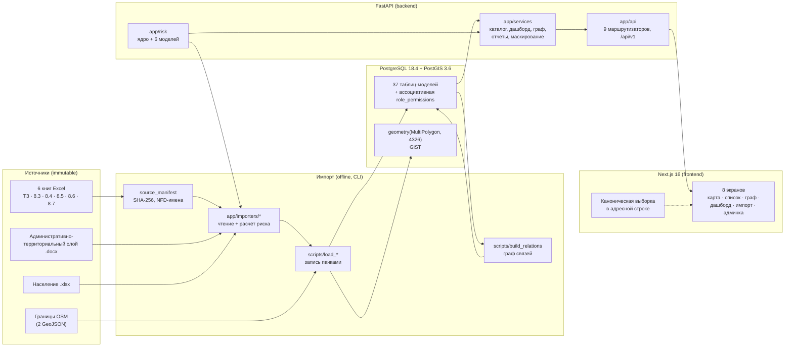
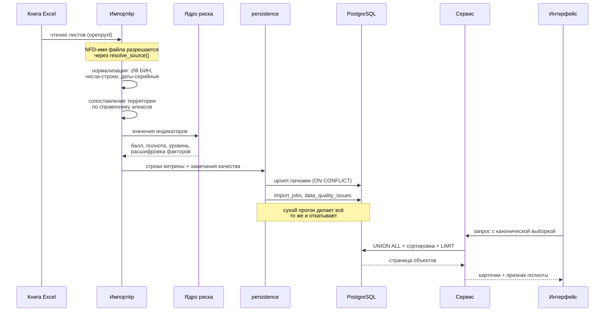

# Архитектура системы

ИАС «Интерактивная карта рисков» — информационно-аналитическая система оценки
социально-экономических и криминогенных рисков в регионе. Документ описывает
фактическое устройство работающей системы: из чего она собрана, как через неё
идут данные, почему выбран именно такой стек и какие ограничения наложила среда
разработки.

Смежные документы: [модель данных](data-model.md),
[сопоставление источников](source-mapping.md), [модели риска](risk-models.md),
[территории](territory-reconciliation.md),
[допущения и пробелы](assumptions-and-gaps.md), [развёртывание](deployment.md).

---

## 1. Общая картина



Ключевая особенность контура: **расчёт риска выполняется один раз, при импорте,
и материализуется в таблицах витрин**. API не пересчитывает баллы на лету. Так
сделано не ради скорости, а ради воспроизводимости: в каждую оценку записаны
код и версия модели, и правка весов администратором не переписывает прошлые
оценки задним числом.

---

## 2. Компоненты

### 2.1. Слой источников

Каталог исходных книг (`SOURCE_DATA_DIR`) считается неизменяемым. Ни один код
проекта в него не пишет. Доказательство этого — не обещание, а
`backend/scripts/source_manifest.py`:

```
python -m scripts.source_manifest build    # зафиксировать SHA-256 всех файлов
python -m scripts.source_manifest verify   # убедиться, что ничего не менялось
```

`verify` возвращает ненулевой код, если файл изменился, исчез или появился
новый. Манифест лежит в `data/source-manifest.json` — 20 файлов с размерами,
временем модификации и SHA-256.

Отдельная особенность, которая уже ломала загрузку: **имена файлов слоёв 8.6 и
8.7 хранятся в Unicode NFD** — «й» записана как «и» + U+0306 (combining breve).
Сравнение с литералом, набранным в NFC, даёт «файл не найден», хотя файл на
месте. Поэтому путь к книге собирается не конкатенацией, а поиском по каталогу
через `scripts.source_manifest.resolve_source()`. Это единственное место, где
правило записано, и все импортёры ходят через него.

### 2.2. Ядро расчёта риска — `backend/app/risk/`

`core.py` (544 строки) содержит каркас, общий для всех методик: измеренные
индикаторы, доступный вес, нормировка, полнота, пороги, коэффициент значимости,
пол балла, жёсткие переопределения. `layers/*.py` содержат шесть методик,
каждая — со своими весами, порогами и правилами.

Ядро отделено от методик намеренно. Методики различаются существенно: пороги
35/55/75 у субсидий против 25/50/75 у остальных, полный вес 110 у ГЧП против 90
у экспертизы, пол балла 75 у бюджета против коэффициента значимости K у
закупок. Усреднять эти различия нельзя — это разные модели, а не разнобой
оформления. Но каркас у них один, и дублировать его пять раз означало бы пять
раз по-разному ошибиться в трактовке «нет данных».

Центральное правило всего проекта закреплено здесь и покрыто тестами:

> **Отсутствие данных — это «не измерено», а не ноль.**

Неизмеренный индикатор не входит ни в числитель, ни в знаменатель. Если не
измерено ничего — балла нет вовсе (`None`), а не 0. Серый уровень при этом
означает «мы не знаем», а не «риска нет», и остаётся полноправным уровнем в
фильтрах, легенде и агрегатах. Подробности — в [risk-models.md](risk-models.md).

### 2.3. Импортёры — `backend/app/importers/`

Шесть модулей чтения источников (`budget_8_3`, `procurement_8_4`,
`subsidies_8_5`, `infrastructure_8_6`, `organizations_8_7`, `territories`) плюс
`persistence.py` — общая механика записи.

Разделение обязанностей жёсткое: **импортёр читает и считает, но не пишет в
базу**. Запись живёт в `persistence.py` и в скриптах `backend/scripts/`. Это
позволяет тестировать чтение книги без базы (и таких тестов большинство), а
интеграционные тесты гонять против живого PostGIS.

Три решения `persistence.py`, которые определяют поведение всего импорта:

* **Идемпотентность на первичном ключе, а не на предварительном `SELECT`.**
  Идентификатор строки выводится из естественного ключа источника:
  `uuid5(namespace, "таблица|natural_key")`. Ключ один и тот же при каждом
  запуске, поэтому повторная загрузка попадает в `ON CONFLICT (id) DO UPDATE`.
  Вариант «выбрать существующие, потом решить» пришлось бы выполнять 21 521 раз
  только на слое 8.5 и он ломается при параллельных запусках.
* **Ссылки между таблицами вычисляются, а не выясняются.** Раз ключ
  детерминирован, `subsidy_payments.recipient_id` — это просто
  `stable_id("subsidy_recipients", БИН)`. Знать настоящий идентификатор
  получателя для вставки выплаты не нужно. То же в слое 8.6, где строка
  супертипа и строка подтипа обязаны иметь один идентификатор.
* **Вставка пачками через Core, а не через ORM.** Размер пачки считается от
  числа колонок, потому что ограничение PostgreSQL — на число параметров
  запроса (65 535), а не на число строк. «Создано» и «обновлено» различаются по
  системному столбцу `xmax`, что даёт оба счётчика из одного запроса.

### 2.4. Сервисы — `backend/app/services/`

| Модуль | Строк | Назначение |
|---|---:|---|
| `catalog.py` | 444 | Единый список объектов всех слоёв: `UNION ALL` нормализованных выборок |
| `dashboard.py` | 428 | Восемь показателей, распределение по уровням, помесячная динамика, рейтинг территорий |
| `graph.py` | 730 | Окружение узла в графе связей, ограничение глубины и числа узлов |
| `import_wizard.py` | 2603 | Трёхшаговый мастер импорта: приём файла, сопоставление колонок, построчная проверка |
| `object_detail.py` | 363 | Карточка объекта с расшифровкой оценки |
| `reports.py` | 1629 | Восемь шаблонов отчётов, сбор данных и форматирование значений |
| `report_render.py` | 730 | Отрисовка в Word, Excel, PDF |
| `masking.py` | 194 | Маскирование ИИН/БИН по роли, журналирование каждого раскрытия |
| `territories.py`, `territory_resolver.py` | 221 + 267 | Справочник территорий и сопоставление названий |
| `layers.py` | 242 | Каталог тематических слоёв и уровней, на которых они существуют |
| `audit.py` | 283 | Журнал действий |

Два места стоит выделить.

**`catalog.py` — единый список.** ТЗ требует, чтобы «Списком» и «На карте» были
двумя представлениями одной выборки. Единственный надёжный способ это
обеспечить — не иметь двух выборок. Пять слоёв приводятся к общей карточке и
отдаются одним запросом. Запрос собирается как `UNION ALL` нормализованных
подвыборок; сортировка и постраничность выполняются базой, а не Python. Собирать
список в приложении означало бы вытягивать все строки всех слоёв на каждый
запрос, а ТЗ требует работы с миллионом записей.

Порядок уровней при сортировке задан явно: по алфавиту получается
`critical < high < low < medium`, что бессмысленно. «Нет данных» получает
ранг −1 и не притворяется низким риском. Третий ключ сортировки добавлен
намеренно: без устойчивого порядка две соседние страницы могут показать один
объект дважды, а другой не показать вовсе.

**`masking.py` — раскрытие не мимо журнала.** Функция раскрытия сама пишет
запись `SENSITIVE_VIEW` и требует для этого пользователя и контекст запроса.
Вариант «вернуть значение, а журналировать в вызывающем коде» отвергнут: он
работает ровно до первого нового эндпоинта, автор которого про журнал забудет,
а провал такой проверки виден только на аудите — то есть слишком поздно.
Маска — 4 знака с начала и 2 с конца (`8407******12`): первые четыре цифры ИИН
это дата рождения и так выводится из карточки, последние две позволяют
различить две записи глазами, не восстанавливая номер.

### 2.5. API — `backend/app/api/`

FastAPI, префикс `/api/v1` (задаётся настройкой `API_PREFIX`), девять
маршрутизаторов:

| Префикс | Файл | Содержание |
|---|---|---|
| `/auth` | `auth_routes.py` | Вход, выход, профиль, права текущего пользователя |
| `/territories` | `territory_routes.py` | Справочник, иерархия, границы GeoJSON, каталог слоёв, карточка |
| `/objects` | `object_routes.py`, `object_detail_routes.py` | Единый список, справочники фильтров, карточка объекта |
| `/dashboard` | `dashboard_routes.py` | Аналитическая панель |
| `/graph` | `graph_routes.py` | Легенда, статистика, поиск узла, окружение узла, соседи |
| `/imports` | `import_routes.py` | Мастер импорта: типы, загрузка, шаблоны, сухой прогон, подтверждение, задания, откат |
| `/admin` | `admin_routes.py` | Пользователи, справочники, модели риска, журнал действий |
| `/reports` | `report_routes.py` | Каталог шаблонов, форматы, генерация |

Плюс служебные `/health` и `/ready` вне версионированного префикса. `/health`
намеренно не трогает базу: приложение может быть живым, но неспособным
обслуживать запросы, и смешивать эти состояния — значит получать перезапуски
там, где нужно просто дождаться базы. `/ready` проверяет и соединение, и
наличие PostGIS.

Два решения по API, зафиксированные в коде:

* **Эндпоинта «весь граф» не существует** — ТЗ это прямо запрещает. Отдаётся
  окружение одного узла с ограничением глубины и числа узлов, проверяемым в
  сигнатуре: запрос сверх предела получает 422, а не съедает память сервера.
  Ответ всегда несёт признак усечения и число пропущенных соседей.
* **Отказ по территории выглядит как «не найден», а не «нет доступа».** Иначе
  перебором выясняется, какие объекты существуют за пределами доступа. Тот же
  принцип на входе: причина отказа не уточняет, существует ли логин.

### 2.6. Фронтенд — `frontend/src/`

Next.js 16.2.10 (App Router), React 19.2.4, Tailwind CSS 4, TypeScript strict.

Восемь маршрутов: `/` (редирект на дашборд), `/dashboard`, `/map`, `/graph`,
`/import`, `/admin`, `/reports`, `/login`.

| Задача | Библиотека |
|---|---|
| Карта | `maplibre-gl` 5.24 |
| Граф связей | `cytoscape` 3.34 |
| Виртуализация длинных списков | `@tanstack/react-virtual` 3.14 |
| Иконки | `lucide-react` 1.25 |
| Кольцевая диаграмма дашборда | рукописный SVG, без библиотеки |

Внешних CDN и веб-шрифтов нет вовсе. Шрифт Geist из шаблона `create-next-app`
убран: он тянулся с Google Fonts, что ломает требование о закрытом контуре, и
подключался только с латинским набором — для русского интерфейса не работал бы
в любом случае. Используются системные шрифты (`ui-sans-serif, system-ui,
"Segoe UI"…`).

**Каноническая выборка живёт в адресной строке**, а не внутри компонента
(`src/lib/query-spec.ts` — зеркало серверного `QuerySpec`, 20 параметров в
snake_case, как на сервере). Иначе при переключении между картой и списком
состояние сбрасывалось бы или расходилось, а ссылку нельзя было бы переслать.
Разбор устойчив к мусору: посторонние параметры, отрицательная страница,
неизвестный уровень риска и запредельный размер страницы не роняют экран, а
заменяются умолчаниями. Уровень «нет данных» входит в умолчания — убрать его
значило бы молча спрятать неизмеренные объекты от пользователя, который
фильтров не трогал.

**Уровень риска передаётся четырьмя каналами помимо цвета**: глифом с разным
силуэтом (`●` низкий, `◆` средний, `▲` высокий, `■` критический, `○` нет
данных), текстовой подписью, паттерном заливки на карте и — для критического
уровня — отдельным слоем штриховки. Это не перестраховка: измерение показало,
что подписи «высокого» и «критического» различаются между собой всего в 1.55:1
в светлой теме и 1.46:1 в тёмной. Цвету доверять нельзя. Скрипт
`scripts/check-contrast.mjs` читает реальные значения из `globals.css` (а не
дублирует их) и проверяет пороги WCAG 2.1 — **44 проверки, все проходят**.

---

## 3. Поток данных



Отдельная ветка — граф связей. Он строится **после** загрузки слоёв, отдельным
скриптом, и перестраивается целиком, а не дополняется. Причина: связь —
производная величина, а не факт. Изменился источник — изменился и набор связей,
включая исчезнувшие. Инкрементальное дополнение оставило бы в витрине связи,
которых в данных больше нет, и обнаружить их было бы нечем.

---

## 4. Почему выбран такой стек

### PostgreSQL + PostGIS

Требование карты с иерархией «республика → область → район → объект» и
пространственными запросами по полигонам делает выбор почти безальтернативным:
PostGIS — единственная зрелая свободная реализация геопространственных типов и
индексов в реляционной СУБД. Геометрия хранится в EPSG:4326 с индексом GiST.

Второй довод — упрощение геометрии выполняется на сервере, а не на клиенте: на
обзорном уровне карта получает упрощённый контур, вблизи — исходный. Мегабайты
границ республики нельзя отправлять в браузер на каждом запросе. При этом
исходная геометрия остаётся нетронутой — все расчёты площадей и
пространственные запросы идут по ней.

### SQLAlchemy 2 + Alembic

Схема из 37 таблиц с 48 внешними ключами и 33 CHECK-ограничениями требует
управляемых миграций. Alembic — штатный инструмент SQLAlchemy. ORM используется
для описания схемы и для чтения; массовая вставка идёт мимо ORM, через Core.

Важно: ограничения объявлены на уровне базы, а не только в конструкторах
Python. Массовая вставка идёт мимо конструктора и не должна обходить правило —
это не гипотеза, а найденный тестами дефект слоя 8.6, где строка, вставленная
без явного указания точности территории, получала `none` вместо `region` и
выглядела как объект вообще без территории.

### FastAPI

Автоматическая генерация OpenAPI, валидация через Pydantic 2 и проверка границ
параметров прямо в сигнатуре. Последнее использовано содержательно: ограничение
глубины и числа узлов графа проверяется типом, поэтому запрос сверх предела
получает 422 до того, как дойдёт до базы.

### Next.js 16 + React 19

Требование ТЗ — интерактивная карта с фильтрами, состояние которых
воспроизводится по ссылке. App Router даёт маршрутизацию и разделение
серверных/клиентских компонентов; Tailwind 4 — систему токенов темы,
позволяющую держать проверку контраста автоматической.

Оговорка: `useSearchParams` в трёх экранах (карта, граф, админка) намеренно **не
используется**. Граница `Suspense`, которую он требует, не разрешалась ни в
разработке, ни в продакшн-сборке — экран бесконечно показывал заглушку, дерево
отрисовывалось в скрытом контейнере, эффекты не запускались, запросы к API не
уходили. Эти экраны читают адрес напрямую через `window.location` и слушают
`popstate`. Состояние по-прежнему живёт в адресной строке, ссылка воспроизводит
экран, кнопки «назад» и «вперёд» работают.

### MapLibre GL, а не Leaflet

Векторные тайлы и стилизация выражениями (`match` по свойству `risk_level`),
что позволяет раскрашивать полигоны без пересборки слоя. Подложки по умолчанию
нет вовсе: карта рисует только собственные границы поверх однотонного фона.
Адрес своего тайл-сервера задаётся `NEXT_PUBLIC_MAP_STYLE_URL` — подставлять
туда публичные внешние сервисы не следует.

### reportlab с DejaVu Sans в репозитории

Все четырнадцать встроенных шрифтов PDF («Base 14») кодируются в WinAnsi и
кириллицы не содержат; шрифт Vera из комплекта самого `reportlab` тоже — в его
таблице `cmap` диапазон U+0400–U+04FF отсутствует целиком. Отчёт на русском,
собранный на встроенном шрифте, выходит либо пустым, либо набором чёрных
квадратов: файл есть, выглядит сформированным, а прочитать его нельзя.

Отката на встроенные шрифты нет намеренно. В репозиторий положен DejaVu Sans
под пермиссивной лицензией Bitstream Vera (см. `data/fonts/PROVENANCE.md`),
взятый с локальной машины, а не из сети. Отсутствие шрифта даёт честный
`501 Not Implemented`; Word и Excel продолжают работать.

---

## 5. Ограничения среды

Эти ограничения — не абстрактные риски, а условия, в которых система собрана и
работает. Они повлияли на архитектуру.

### 5.1. Нет Docker и нет прав администратора

PostgreSQL 18.4 и PostGIS 3.6.2 развёрнуты локально из ZIP-бинарников, без
установщика и без службы Windows: кластер инициализирован `initdb` в
пользовательский каталог, сервер запускается `pg_ctl` на порту **5433**
(нестандартном, чтобы не конфликтовать с возможной будущей штатной установкой
на 5432), аутентификация `trust`, слушает только loopback.

Последствия:

* Строка подключения по умолчанию —
  `postgresql+psycopg://postgres@127.0.0.1:5433/riskmap`.
* `trust` без пароля допустим только для локального dev-кластера на loopback.
  Для чего-либо иного так делать нельзя, и это записано в
  [deployment.md](deployment.md).
* Переменные `GDAL_DATA` и `PROJ_LIB` задаются **до** запуска сервера —
  серверный процесс наследует их от `pg_ctl`.

Полная последовательность — в [deployment.md](deployment.md) и в
`docs/audit/07-lokalnyy-postgis.md`.

Существенно, что это не гипотетическая инфраструктура: интеграционные тесты
идут против живой базы. Прежняя версия проекта была заархивирована именно
потому, что инфраструктура там была написана, но ни разу не запускалась.

### 5.2. Закрытый контур

ТЗ (раздел 19) требует возможности развёртывания в контуре без интернета.
Отсюда: нет внешних CDN, нет веб-шрифтов, нет внешней картографической
подложки, шрифт для PDF лежит в репозитории. Границы OSM выгружены один раз
через Overpass API и сохранены в `data/boundaries/` вместе с полным
`PROVENANCE.md`: точным текстом запросов, датой среза, SHA-256 и контролем
качества геометрий.

### 5.3. Windows PowerShell 5.1

Замена строк через PowerShell 5.1 однажды прочитала UTF-8 как ANSI и записала
обратно как UTF-8, получив двойное кодирование в шести файлах. Кодировка была
восстановлена, обратимость преобразования проверена побайтово до записи.
Практическое правило, действующее в проекте: файлы правятся инструментами,
сохраняющими UTF-8 без BOM, а не `Set-Content`/`Out-File`.

В `.gitattributes` закреплено: в репозитории LF, кроме `*.ps1`/`*.cmd`/`*.bat`,
которым нужен CRLF.

### 5.4. Данные, которых нет

Три ограничения этого рода определили архитектуру сильнее, чем любое
техническое:

* **КАТО отсутствует во всех книгах.** Единственный официальный ключ стыковки
  территорий недоступен, связывание идёт по названиям через справочник алиасов.
  Отсюда отдельный модуль `territory_resolver` и таблица `territory_aliases`.
  См. [territory-reconciliation.md](territory-reconciliation.md).
* **Слой 8.7 не имеет территориальной привязки вообще** — ни района, ни адреса,
  ни координат, ни КАТО. Поэтому 3668 организаций не выводятся на карту, и
  каталог слоёв объявляет уровни, на которых слой существует, а интерфейс
  объясняет недоступность словами. Пустая заливка неотличима от нулевого риска.
* **Состава учредителей нет ни в одной книге.** Тип связи «учредитель» в графе
  объявлен, функция вывода написана и вызывается, отчёт печатает ноль, и
  отдельный тест это закрепляет — чтобы никто потом не заполнил его догадками.

---

## 6. Проверки

Актуальное состояние, проверенное запуском:

| Проверка | Команда | Результат |
|---|---|---|
| Тесты backend | `pytest` в `backend/` | **1115 тестов** в 23 файлах |
| Типизация backend | `mypy app` | strict, чисто на **60 файлах** |
| Линтер backend | `ruff check app scripts tests` | чисто |
| Тесты frontend | `npm test` | **218 тестов** в 17 файлах |
| Типизация frontend | `npm run typecheck` | `tsc --noEmit`, strict |
| Контраст | `npm run check:contrast` | **44 проверки**, все проходят |

Оговорка про `ruff`: запуск `ruff check .` из корня `backend/` даёт замечания в
каталоге `alembic/` — это автогенерируемые миграции, которые под линтер
проекта не заводились. Проверяются `app`, `scripts`, `tests`.

Оговорка про `mypy`: `mypy app` — 60 файлов; `mypy app scripts` — 66 и тоже
чисто.

Маркеры pytest: `golden` — сверка расчёта с эталонными строками книг, `slow` —
чтение больших книг целиком, `integration` — требуется живая база.
