# Модель данных

Схема создана Alembic и применена к работающему PostgreSQL 18.4 / PostGIS 3.6.
Это не сгенерированный «на будущее» файл: миграция выполнена, и все числа ниже
получены запросами к живой базе.

| Величина | Значение |
|---|---:|
| ORM-моделей с `__tablename__` | **37** |
| Физических таблиц (плюс ассоциативная `role_permissions`) | 38 |
| Внешних ключей | 48 |
| CHECK-ограничений | 33 |
| UNIQUE-ограничений | 31 |
| Индексов | 205 |
| GiST-индексов по геометрии | 1 (`idx_territory_geometries_geom`) |
| Текущая ревизия Alembic | `82058b2d49df` |

Служебные `alembic_version` и `spatial_ref_sys` (таблица PostGIS) в счёт не
входят.

Смежные документы: [архитектура](architecture.md),
[сопоставление источников](source-mapping.md), [модели риска](risk-models.md),
[территории](territory-reconciliation.md),
[допущения и пробелы](assumptions-and-gaps.md).

---

## 1. Общая схема

```mermaid
erDiagram
    TERRITORIES ||--o{ TERRITORIES : "parent_id"
    TERRITORIES ||--o| TERRITORY_GEOMETRIES : "геометрия"
    TERRITORIES ||--o{ TERRITORY_ALIASES : "написания"
    TERRITORIES ||--o{ POPULATION_STATS : "население"
    BOUNDARY_VERSIONS ||--o{ TERRITORY_GEOMETRIES : "версия границ"

    SOURCE_FILES ||--o{ SOURCE_DATASETS : "листы файла"
    SOURCE_DATASETS ||--o{ IMPORT_JOBS : "что грузили"
    IMPORT_JOBS ||--o{ DATA_QUALITY_ISSUES : "замечания"
    USERS ||--o{ IMPORT_JOBS : "кто запустил"

    ROLES ||--o{ USERS : "роль"
    ROLES }o--o{ PERMISSIONS : "role_permissions"
    TERRITORIES ||--o{ USERS : "ограничение доступа"
    USERS ||--o{ AUDIT_LOG : "действия"
    USERS ||--o{ SAVED_VIEWS : "подборки"

    BUDGET_PROGRAMS ||--o{ BUDGET_FACTS : "статья"
    TERRITORIES ||--o{ BUDGET_MONTHLY_METRICS : "область"
    TERRITORIES ||--o{ BUDGET_FACTS : "область"

    SUPPLIERS ||--o{ CONTRACTS : "поставщик"
    PROCUREMENT_CUSTOMERS ||--o{ PROCUREMENT_LOTS : "заказчик"
    PROCUREMENTS ||--o{ PROCUREMENT_LOTS : "объявление"
    PROCUREMENTS ||--o{ CONTRACTS : "закупка"
    CONTRACTS ||--o{ CONTRACT_ADDITIONS : "доп. соглашения"
    TERRITORIES ||--o{ CONTRACTS : "район поставщика"

    SUBSIDY_RECIPIENTS ||--o{ SUBSIDY_PAYMENTS : "выплаты"
    SUBSIDY_PROGRAMS ||--o{ SUBSIDY_PAYMENTS : "программа"
    TERRITORIES ||--o{ SUBSIDY_RECIPIENTS : "район"

    PROJECT_ENTITIES ||--o| PPP_PROJECTS : "тип A"
    PROJECT_ENTITIES ||--o| CONSTRUCTION_EXPERTISE_OBJECTS : "тип B"
    PROJECT_ENTITIES ||--o{ PROJECT_PARTICIPANTS : "участники"
    TERRITORIES ||--o{ PROJECT_ENTITIES : "территория"

    ORGANIZATIONS ||--o{ IDENTIFIERS : "БИН, сырой и канон."
    ORGANIZATIONS ||--o{ ORGANIZATION_PERSON_ROLES : "роли лиц"
    PERSONS ||--o{ ORGANIZATION_PERSON_ROLES : "лицо"
    ADDRESSES ||--o{ ORGANIZATIONS : "адрес"

    GRAPH_NODES ||--o{ ENTITY_RELATIONS : "источник"
    GRAPH_NODES ||--o{ ENTITY_RELATIONS : "цель"
```

Диаграмма показывает связи по существу; полный перечень внешних ключей — в
миграциях `backend/alembic/versions/`.

---

## 2. Группы таблиц

### 2.1. Территориальный костяк (5 таблиц)

| Таблица | Строк | Назначение |
|---|---:|---|
| `territories` | 32 | Справочник территорий: 1 страна + 20 регионов + 9 районов + 2 города |
| `territory_geometries` | 31 | Геометрия: исходная, два уровня упрощения, центроид |
| `boundary_versions` | 2 | Версия набора границ: источник, лицензия, дата действия, SHA-256 |
| `territory_aliases` | 124 | Написания названий: официальные, транслитерации, написания источников, исторические |
| `population_stats` | 12 | Численность населения по 11 единицам Алматинской области + область в целом |

`territories` самоссылочна через `parent_id`: страна → регион → район/город.
Уровни (`TerritoryLevel`) — `country`, `region`, `district`, `city`.

Геометрий 31, а не 32: у одной территории полигона нет. Это видимое следствие
того, что границы взяты из OSM, а не достроены догадками.

`territory_geometries` хранит четыре геометрических столбца в EPSG:4326:
`geom` (исходная), `geom_simplified_mid`, `geom_simplified_low`, `centroid`.
Упрощение нужно, чтобы не отправлять мегабайты границ на карту республики, но
**исходная геометрия остаётся нетронутой** — все расчёты площадей и
пространственные запросы идут по ней. Выбор уровня детализации делает API по
масштабу запроса.

`boundary_versions` существует ради версионирования административного
устройства. Реформа 8 июня 2022 года разделила бывшую Алматинскую область;
без атрибута «на какую дату действует граница» суммы по области несопоставимы
между периодами. Обе текущие записи несут `valid_from`, лицензию (ODbL 1.0),
формулировку атрибуции и SHA-256 исходного файла. Подробности — в
[territory-reconciliation.md](territory-reconciliation.md).

`territory_aliases` — прямое следствие отсутствия КАТО. Распределение по видам:
транслитерации 59, официальные названия 57, написания источников 6,
исторические 2.

### 2.2. Происхождение и качество данных (4 таблицы)

| Таблица | Строк | Назначение |
|---|---:|---|
| `source_files` | 9 | Файл-источник: имя, нормализованное имя, SHA-256, размер, происхождение |
| `source_datasets` | 17 | Лист внутри файла: код слоя, роль, число строк, строка заголовка, дата актуальности |
| `import_jobs` | 127 | Задание импорта: статус, кто запустил, счётчики, версия данных |
| `data_quality_issues` | 3531 | Замечание: код, серьёзность, адрес строки, колонка, пояснение |

Это скелет доверия к данным. Любая витрина отвечает на вопрос «откуда эта
строка» через `ProvenanceMixin` (см. § 3), а таблицы этой группы дают
контекст: из какого файла, какого листа, каким заданием и с какими замечаниями.

Распределение замечаний по серьёзности: `info` 3050, `warning` 479,
`error` **2**. Самые частые коды:

| Код | Штук | Что означает |
|---|---:|---|
| `dash_interpreted` | 2457 | В ячейке прочерк, истолкован как отсутствие значения |
| `area_mismatch_with_document` | 351 | Площадь по геометрии расходится с ведомственным документом |
| `row_out_of_scope` | 117 | Строка вне области действия слоя |
| `synthetic_root` | 117 | Корневой узел иерархии создан загрузчиком, в источнике его нет |
| `level_not_in_reference` | 117 | Уровень иерархии отсутствует в справочнике |
| `kato_missing` | 117 | Кода КАТО нет в источнике |
| `duplicate_osm_object` | 117 | Объект OSM встречается в двух наборах границ |
| `territory_not_resolved` | 110 | Название территории не сопоставлено со справочником |
| `value_truncated` | 10 | Значение обрезано под ограничение длины поля |
| `schema_cannot_represent_source` | **2** (`error`) | Схема не может выразить то, что лежит в источнике |

Обратите внимание: `kato_missing` и `duplicate_osm_object` — не сбои загрузки, а
зафиксированные факты источников, воспроизведённые как есть. Замечания
о неопознанных территориях **группируются по написанию**: построчная запись дала
бы более двадцати тысяч одинаковых строк журнала за один запуск. Само правило
при этом не смягчается — территория неопознанной строки остаётся `NULL`.

### 2.3. Доступ (5 таблиц)

| Таблица | Строк | Назначение |
|---|---:|---|
| `permissions` | 18 | Атомарные права |
| `roles` | 4 | Роли: `admin`, `analyst`, `manager`, `viewer` |
| `role_permissions` | 42 | Ассоциация «роль → право» |
| `users` | 5 | Учётные записи (демонстрационные) |
| `audit_log` | 21 | Журнал действий |
| `saved_views` | 0 | Сохранённые подборки фильтров |

Восемнадцать прав: `audit.view`, `data.edit`, `data.import`,
`data.import.rollback`, `data.view`, `export.data`, `map.view`,
`report.generate`, `risk.explain`, `risk.model.edit`, `risk.view`,
`roles.manage`, `sensitive.view`, `source.manage`, `territory.manage`,
`users.manage`, `views.save`, `views.share`.

Разделение обязанностей: **роль отвечает за то, что можно, территория — за то,
где**. Территориальное ограничение (`users.territory_id`) накладывается на
сервере рекурсивным обходом иерархии. Пустой список разрешённых территорий и
отсутствие ограничения — разные вещи: первое обязано давать пустую выборку,
второе полную.

Уровень доступа к персональным данным по умолчанию самый строгий: право видеть
ИИН (`sensitive.view`) выдаётся явно. Правка весов и порогов — отдельное право
(`risk.model.edit`), а не следствие роли администратора.

`audit_log` доступен **только на запись**: маршрутов записи в API нет,
проверено кодом 405. Логин хранится строкой, а не только ссылкой на
пользователя, — чтобы удаление учётной записи не обезличивало историю её
действий.

### 2.4. Слой 8.3 — бюджет (3 таблицы)

| Таблица | Строк | Назначение |
|---|---:|---|
| `budget_programs` | 416 | Статья бюджетной классификации (иерархия) |
| `budget_facts` | **0** | Исполнение статьи в области за месяц |
| `budget_monthly_metrics` | 240 | Расчётная строка «область × месяц»: 15 индикаторов и балл |

240 = 20 областей × 12 месяцев 2025 года. Проверено запросом: в таблице ровно
20 различных территорий и 12 различных периодов.

**`budget_facts` пуста, и это осознанное состояние.** Загружен справочник
программ и расчётный слой, но не 74 831 строка сырой бюджетной иерархии.
Причина в том, что расчётные строки в книге получены агрегацией, выполненной
вне Excel и внутри книги невоспроизводимой: колонки A–AL расчётного листа —
константы, а не формулы. Загружать сырьё, из которого нельзя пересобрать
витрину, значило бы создать видимость трассируемости. Ограничение названо
прямо в [assumptions-and-gaps.md](assumptions-and-gaps.md).

### 2.5. Слой 8.4 — госзакупки (6 таблиц)

| Таблица | Строк | Назначение |
|---|---:|---|
| `suppliers` | 26 | Поставщик: БИН, признаки категории A |
| `procurement_customers` | 118 | Заказчик закупки |
| `procurements` | 190 | Объявление о закупке |
| `procurement_lots` | 358 | Лот объявления |
| `contracts` | **355** | Договор — единица анализа слоя |
| `contract_additions` | 583 | Дополнительное соглашение |

Единица анализа — договор. 355 договоров по 26 поставщикам. Адрес есть только у
этих 26 поставщиков; у 3668 организаций слоя 8.7 его нет вовсе — это станет
важно в графе связей.

### 2.6. Слой 8.5 — субсидии (3 таблицы)

| Таблица | Строк | Назначение |
|---|---:|---|
| `subsidy_recipients` | **3413** | Получатель субсидии — единица анализа слоя |
| `subsidy_payments` | **21521** | Выплата/заявка |
| `subsidy_programs` | 46 | Программа субсидирования |

Единица оценки — получатель, а не выплата. Так решено в самой книге, и это
правильно: один получатель может провести десятки заявок, а риск концентрации
или аффилированности виден только на уровне лица.

`subsidy_recipients` хранит **две оценки**: `risk_score`/`risk_level` в
семантике проекта (пустая ячейка = «не измерено») и `book_risk_score` /
`book_risk_level` / `book_risk_exposure` / `book_rank` — в семантике Excel
(пустая ячейка = 0). Вторая нужна исключительно для сверки с контрольными
числами книги и пользователю не показывается. Расхождение разобрано в
[assumptions-and-gaps.md](assumptions-and-gaps.md).

Суммарный объём субсидий: **67 535 553 445 ₸** (проверено
`select sum(total_amount) from subsidy_recipients`).

### 2.7. Слой 8.6 — инфраструктурные проекты (4 таблицы)

| Таблица | Строк | Назначение |
|---|---:|---|
| `project_entities` | **6165** | Супертип: имя, территория, точность привязки, оценка риска, происхождение |
| `ppp_projects` | **1323** | Тип A — проекты ГЧП |
| `construction_expertise_objects` | **4842** | Тип B — заключения строительной экспертизы |
| `project_participants` | 12271 | Участники объектов |

Это самое существенное решение схемы, и оно нуждается в объяснении.

**В слое 8.6 лежат две несвязанные популяции без общего ключа.** Аудит проверил
три возможные связки и все три дали ноль:

* БИН частного партнёра: 0 совпадений из 1014 в реестре поставщиков ГЧП и
  0 из 4842 в экспертизе;
* пересечение нормализованных наименований: 0 на 1266 × 4781;
* совпадение участников: нет.

Отдельным тестом закреплено, что наивная связка по номеру даёт **198 ложных
совпадений**. Число держится на виду, чтобы такую связку никто не завёл
«потому что сходится».

Поэтому популяции разведены на две таблицы через супертип `project_entities`.
Супертип **намеренно не содержит ни одного предметного поля** одной из
популяций — иначе склеивание началось бы молча. В нём только то, что
действительно общее: имя, территориальная привязка с указанием её точности,
оценка риска и происхождение записи.

`territory_precision` — не косметика. Фактическое распределение:

| Тип | Точность | Штук |
|---|---|---:|
| `ppp_project` | `region` | 1323 |
| `expertise_conclusion` | `region` | 3874 |
| `expertise_conclusion` | `district` | 357 |
| `expertise_conclusion` | `none` | 611 |

У всех проектов ГЧП точность принудительно равна «область»: районной привязки
нет ни в одном из пяти исходных реестров. Различие между «известна только
область» и «территория неизвестна» существенно — они по-разному отвечают на
вопрос, можно ли показывать объект на районной карте. Значение по умолчанию
задано и в конструкторе, и ограничением на уровне базы: массовая вставка идёт
мимо конструктора и не должна обходить правило.

### 2.8. Слой 8.7 — организации (5 таблиц)

| Таблица | Строк | Назначение |
|---|---:|---|
| `organizations` | **3668** | Юридическое лицо — объект слоя |
| `identifiers` | 3668 | Идентификатор в сыром и каноническом виде |
| `addresses` | **0** | Адрес регистрации |
| `persons` | **0** | Физическое лицо |
| `organization_person_roles` | **0** | Роль лица в организации |

Три пустые таблицы — не недоделка, а зафиксированное состояние источника.
В книге 8.7 нет ни адреса, ни состава учредителей, ни сведений о физических
лицах в структурированном виде. Таблицы объявлены, потому что модель ТЗ их
предусматривает, и заполнить их можно будет без изменения схемы, когда
появятся источники.

`territory_status` у всех 3668 организаций — `not_determined`. Это следствие
того же: территориальной привязки в книге нет ни в каком виде.

`organizations` хранит **две оценки уровня**: `risk_level_strict` (официальная)
и `risk_level_preliminary` (по одному лишь баллу, без учёта полноты).
Фактическое распределение:

| Поле | Распределение |
|---|---|
| `risk_level_strict` | `unknown` 3645, `critical` 23 |
| `risk_level_preliminary` | `low` 1147, `medium` 2211, `high` 278, `critical` 32 |

Строгий уровень серый почти у всех, потому что максимальная полнота во всей
выборке — **40.9 %** (минимальная 31.8 %), ниже порога 50 %. Критическими
становятся ровно 23 организации категории A — по юридически подтверждённому
факту, а не по баллу. Подробности — в [risk-models.md](risk-models.md).

### 2.9. Граф связей (2 таблицы)

| Таблица | Строк | Назначение |
|---|---:|---|
| `graph_nodes` | **11782** | Узел графа |
| `entity_relations` | **16266** | Связь между двумя узлами |

Узлы по типам: `project` 6104, `person` 3409, `organization` 1868,
`contract` 355, `subsidy` 46.

Связи по типам и достоверности:

| Тип связи | Достоверность | Штук |
|---|---|---:|
| `recipient` — получатель поддержки | `confirmed` | 9561 |
| `contractor` — подрядчик/проектировщик | `probable` | 6104 |
| `supplier` — поставщик по договору | `confirmed` | 355 |
| `director` — руководитель | `probable` | 230 |
| `co_recipient` — общий руководитель у двух получателей | `probable` | 15 |
| `shared_address` — общий юридический адрес | `probable` | **1** |
| `founder` — учредитель | — | **0** |

Итого `confirmed` 9916, `probable` 6350.

Два нуля (и одна единица) в этой таблице — самое ценное, что в ней есть.

**`founder` = 0.** Состава учредителей нет ни в одной книге комплекта. Тип
объявлен, функция вывода написана и вызывается, отчёт печатает ноль, и
отдельный тест это закрепляет — чтобы никто потом не заполнил его догадками.
Аффилированность, выведенная из ничего, в аналитической справке неотличима от
установленной.

**`shared_address` = 1.** Адрес есть только у 26 поставщиков слоя 8.4; у 3668
организаций слоя 8.7 его нет вовсе. Одна пара — это всё, что данные дают.

Достоверность различается визуально: совпадение идентификатора — сплошная
линия, совпадение имени или адреса — пунктир. У каждой связи есть основание
человеческими словами и правило вывода для трассировки до строки источника.

Ключ узла (`GraphNode.key`) намеренно **не содержит идентификатора**: ключ
уезжает в адресную строку. ИИН отличается от БИН по пятой цифре; признак сверен
с независимым источником — 3183 индивидуальных предпринимателя книги совпали
ровно.

---

## 3. Происхождение записей

Ключевое соглашение всего проекта: **у каждой бизнес-записи есть
происхождение**. `ProvenanceMixin` (`backend/app/db/base.py`) подмешан во все
таблицы фактов и добавляет девять столбцов:

| Столбец | Смысл |
|---|---|
| `source_dataset_id` | Лист источника (`source_datasets`) |
| `import_job_id` | Задание импорта, которым запись создана или обновлена |
| `source_row_ref` | Адрес исходной строки, например `Расчёт по договорам!A42` |
| `natural_key` | Устойчивый ключ записи в терминах источника |
| `imported_at` | Когда загрузили |
| `data_as_of` | **На какую дату актуальны сами данные** |
| `validation_status` | `ok` / `warning` / `error` — результат проверок строки |
| `validation_notes` | Подробности проверки (JSONB) |
| `data_version`, `is_current` | Логическая версия и признак актуальности |

`imported_at` и `data_as_of` разведены намеренно. Их постоянно путают, и из-за
этого в отчёт попадает «свежая» цифра полугодовой давности. В базе видно, что
это разные вещи: например, у листов слоя 8.3 `data_as_of` = 2025-12-31, а
загружены они 2026-07-21.

`source_row_ref` — это то, что делает возможной трассировку оценки до строки
книги. Карточка объекта показывает каждый фактор с источником, и источник — не
«книга 8.4», а конкретная ячейка.

---

## 4. Версионирование

Версионирование в системе трёхуровневое, и уровни не смешиваются.

### 4.1. Версия данных

`data_version` + `is_current` на каждой записи витрины. Логическая версия
считается от **SHA-256 файла**: тот же файл даёт ту же версию. Откат задания
импорта снимает признак актуальности у строк своей версии и переводит задание в
состояние отката, не удаляя ни строк, ни замечаний, ни записей журнала.

> **Честное ограничение, записанное в коде: откат отзывает актуальность версии,
> но не восстанавливает прежние значения полей. Построчной истории в схеме
> нет.**

Это значит, что если импорт обновил колонку у существующей строки, откат вернёт
строку в неактуальное состояние, но не вернёт колонке прежнее значение. Для
полноценного восстановления нужна таблица истории версий строк, которой в схеме
нет; вводить её без запроса означало бы удвоить объём всех витрин.

Отдельное правило: **в обновление попадают только сопоставленные колонки**.
Иначе импорт файла с двумя колонками обнулил бы всё, что посчитал загрузчик
книги.

### 4.2. Версия модели риска

В каждую оценку записываются `risk_model_code` и `risk_model_version` — не
ссылка на «текущую» конфигурацию. Реестр моделей (`ModelRegistry` в
`app/risk/core.py`) хранит спецификации по паре «код + версия».

Правка весов и порогов администратором создаёт **новую версию** модели и
пишется в журнал отдельным действием, а прошлые оценки не трогаются. Есть тест
на неизменность версии и балла ранее посчитанных объектов. Без этого правка
веса задним числом переписала бы историю: отчёт, сформированный вчера, перестал
бы воспроизводиться сегодня.

### 4.3. Версия границ

`boundary_versions` + `territory_geometries.boundary_version` — см. § 2.1.
Рубежи административных реформ: 31.03.2018 (выделение Кегенского района),
08.06.2022 (Указ № 887, создание областей Абай, Жетісу, Ұлытау), 09.01.2024
(создание города Алатау). См. [territory-reconciliation.md](territory-reconciliation.md).

---

## 5. Два места, где схема устроена нетривиально

### 5.1. Цикл в графе таблиц разорван отложенным ограничением

Территории несут происхождение и потому ссылаются на задание импорта; задание
ссылается на пользователя, запустившего его; пользователь ограничен
территорией. Ни одну из трёх связей нельзя убрать по существу.

Решение: две из трёх связей навешиваются отдельным `ALTER` после создания
таблиц (`use_alter=True` в `ProvenanceMixin`), а не встраиваются в
`CREATE TABLE`.

### 5.2. Наследование в слое 8.6 держится на детерминированном ключе

Строка супертипа `project_entities` и строка подтипа (`ppp_projects` либо
`construction_expertise_objects`) обязаны иметь **один и тот же**
идентификатор. Обеспечивается это тем, что оба ключа вычисляются одной
функцией `stable_id(таблица, естественный_ключ)`, а не выясняются
дополнительным запросом после вставки супертипа.

---

## 6. Полный перечень таблиц с числом строк

Состояние базы на момент составления документа:

| Таблица | Строк | Группа |
|---|---:|---|
| `addresses` | 0 | 8.7 |
| `audit_log` | 21 | доступ |
| `boundary_versions` | 2 | территории |
| `budget_facts` | 0 | 8.3 |
| `budget_monthly_metrics` | 240 | 8.3 |
| `budget_programs` | 416 | 8.3 |
| `construction_expertise_objects` | 4842 | 8.6 |
| `contract_additions` | 583 | 8.4 |
| `contracts` | 355 | 8.4 |
| `data_quality_issues` | 3531 | происхождение |
| `entity_relations` | 16266 | граф |
| `graph_nodes` | 11782 | граф |
| `identifiers` | 3668 | 8.7 |
| `import_jobs` | 127 | происхождение |
| `organization_person_roles` | 0 | 8.7 |
| `organizations` | 3668 | 8.7 |
| `permissions` | 18 | доступ |
| `persons` | 0 | 8.7 |
| `population_stats` | 12 | территории |
| `ppp_projects` | 1323 | 8.6 |
| `procurement_customers` | 118 | 8.4 |
| `procurement_lots` | 358 | 8.4 |
| `procurements` | 190 | 8.4 |
| `project_entities` | 6165 | 8.6 |
| `project_participants` | 12271 | 8.6 |
| `role_permissions` | 42 | доступ |
| `roles` | 4 | доступ |
| `saved_views` | 0 | доступ |
| `source_datasets` | 17 | происхождение |
| `source_files` | 9 | происхождение |
| `subsidy_payments` | 21521 | 8.5 |
| `subsidy_programs` | 46 | 8.5 |
| `subsidy_recipients` | 3413 | 8.5 |
| `suppliers` | 26 | 8.4 |
| `territories` | 32 | территории |
| `territory_aliases` | 124 | территории |
| `territory_geometries` | 31 | территории |
| `users` | 5 | доступ |
