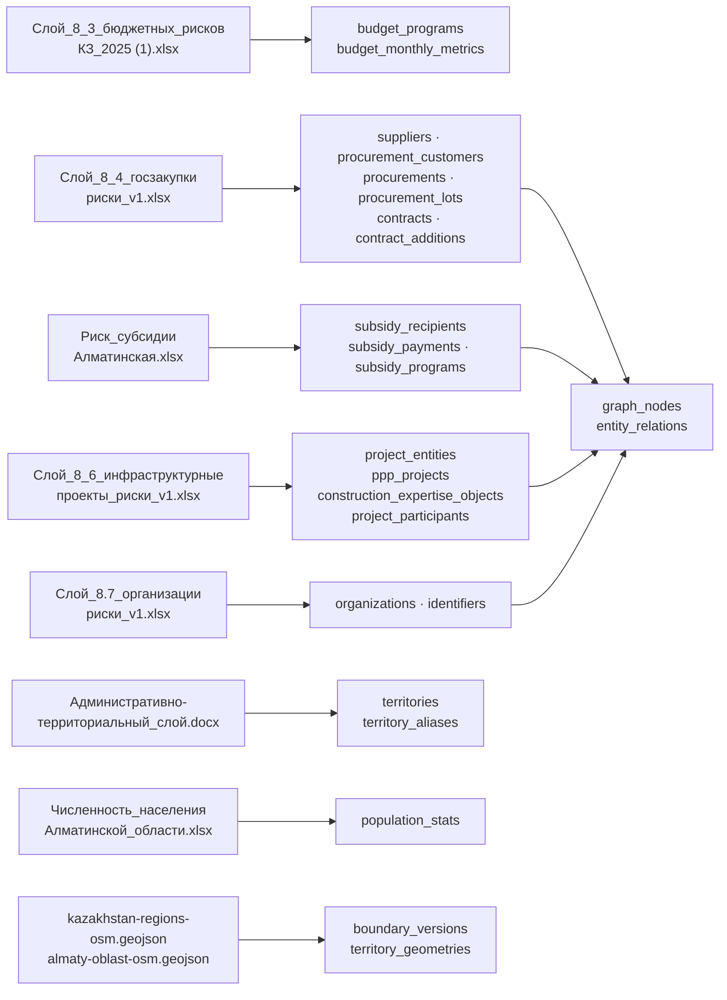

# Сопоставление источников с моделью данных

Документ отвечает на один вопрос: **откуда взялось каждое поле в базе**. Для
каждого источника — файл, лист, колонка, куда она легла и что с ней произошло
по дороге.

Полный аудит источников — в `docs/audit/`:

| Документ | Содержание |
|---|---|
| [`01-tz-i-administrativnyy-sloy.md`](audit/01-tz-i-administrativnyy-sloy.md) | ТЗ дословно + административно-территориальный документ |
| [`02-sloy-8-3-byudzhet-i-8-4-goszakupki.md`](audit/02-sloy-8-3-byudzhet-i-8-4-goszakupki.md) | Книги 8.3 и 8.4: листы, колонки, формулы, контрольные значения |
| [`03-sloi-8-5-8-6-8-7.md`](audit/03-sloi-8-5-8-6-8-7.md) | Книги 8.5, 8.6, 8.7 |
| [`04-geodannye.md`](audit/04-geodannye.md) | Геоданные: GADM, лицензия, реформа 2022 |
| [`05-naselenie.md`](audit/05-naselenie.md) | Книга численности населения |
| [`06-ui-referensy.md`](audit/06-ui-referensy.md) | UI-референсы: экраны, палитра |
| [`07-lokalnyy-postgis.md`](audit/07-lokalnyy-postgis.md) | Развёртывание PostGIS без прав администратора |
| [`08-next16-shpargalka.md`](audit/08-next16-shpargalka.md) | Next.js 16: подводные камни |

Смежные документы: [модель данных](data-model.md), [модели риска](risk-models.md),
[допущения и пробелы](assumptions-and-gaps.md).

---

## 0. Общие правила разбора

Эти правила действуют во всех импортёрах и объясняют бо́льшую часть кода
преобразований.

| Правило | Почему |
|---|---|
| Имя файла ищется по каталогу, а не собирается конкатенацией | Имена книг 8.6 и 8.7 хранятся в **Unicode NFD**: «й» = «и» + U+0306. Сравнение с NFC-литералом даёт «файл не найден» при существующем файле. Единственная точка входа — `scripts.source_manifest.resolve_source()` |
| Заглушки `'—'`, `'nan'`, `'None'`, `'null'`, `'-'` — это «нет данных» | Это **строки**, а не пустые ячейки. Фильтр «по пусто» их не поймает, и `'nan'` превратится в осмысленный способ закупки |
| Числа читаются через собственный парсер | Денежные суммы записаны строками с пробелами: `'11 953 000.00'`, причём разделителем бывает неразрывный пробел U+00A0. `float()` на таком падает |
| БИН/ИИН дополняется нулями слева до 12 знаков | Источники хранят их числом. У 763 организаций из 3668 (20.8 %) и 70 получателей из 3413 потеряны ведущие нули. Джойн без восстановления теряет пятую часть связей |
| Значение длиннее 12 знаков — не «плохо отформатированный БИН» | Это другая сущность, и молча подрезать её нельзя. Импорт останавливается |
| Территория берётся из справочника алиасов или не берётся вовсе | Подставить «похожий» район значило бы приписать чужие деньги чужой территории. Неопознанное название даёт `territory_id = NULL` и замечание `territory_not_resolved` |
| Названия в данных не исправляются | Данные — свидетельство. Опечатка источника заводится алиасом вида `SOURCE_SPELLING`, а исходное написание остаётся видимым |
| Балл риска считает загрузчик, а не книга | В книге 8.5 все 10 240 формул без кэша и читаются как `None`; расчётные листы 8.4, 8.6, 8.7 — статические экспорты вовсе без формул. Значения книг сохраняются отдельно, только для сверки |

---

## 1. Слой 8.3 — «Бюджетные риски»

**Файл:** `Слой_8_3_бюджетных_рисков_КЗ_2025 (1).xlsx`, 11 листов.
**Импортёр:** `backend/app/importers/budget_8_3.py`,
запись — `backend/scripts/load_layers.py --layer 8.3`.
**Единица анализа:** область × месяц. 240 строк = 20 областей × 12 месяцев 2025.

### Читаемые листы

| Лист | Строк | Заголовок | Что берётся |
|---|---:|---|---|
| `Параметры` | 31×7 | — | Веса, пороги нормировки и направления 15 индикаторов |
| `Расчет_месяц` | 240 | стр. 1 | Сырые показатели индикаторов (колонки AT…BG) + контрольные значения книги |
| `RAW_DATA_Бюджет_все_регионы_КЗ_` | 74 831 | стр. 1 | Иерархия бюджетной классификации → `budget_programs` |
| `Функции_расходов` | 240 | стр. 1 | Читается для контроля (HHI по функциям расходов) |

Листы `Паспорт`, `Словарь_полей`, `Методика`, `Панель`, `Тепловая_карта`,
`Концепция_карты`, `Контроль_качества` не загружаются: они методические.

### Отображение полей

| Лист | Колонка (0-based) | Смысл | Куда легло |
|---|---|---|---|
| `Расчет_месяц` | 0 | Уровень геоиерархии | `budget_monthly_metrics.geo_level` |
| `Расчет_месяц` | 1 | `territory_id` книги (`REG-001`…`REG-020`) | `budget_monthly_metrics.source_territory_code` |
| `Расчет_месяц` | 2 | Код родительской территории | `budget_monthly_metrics.parent_territory_code` |
| `Расчет_месяц` | 3 | Регион источника (написание как есть) | `budget_monthly_metrics.source_region_name` |
| `Расчет_месяц` | 4 | Территория (норм.) | `budget_monthly_metrics.territory_name_normalized`; через резолвер → `territory_id` |
| `Расчет_месяц` | 5, 6 | Месяц, период `MM.YYYY` | `period_month`, `period_year`, `period` |
| `Расчет_месяц` | 29 (AD) | Конечный остаток бюджетных средств | `closing_balance` |
| `Расчет_месяц` | 35 | Признак отсутствующих корневых разделов | `missing_roots_flag` |
| `Расчет_месяц` | 45–59 (AT…BG) | 15 сырых показателей R01…R15 | `r01_revenue_execution` … `r15_quality_flags` |
| `Расчет_месяц` | 74, 75, 76, 80, 82 | Балл, уровень, ранг, полнота, признак переопределения книги | сверяются с расчётом, в витрину идёт **свой** результат |
| `RAW_DATA` | `id`, `code`, `name`, `level`, `parentCode`, `parent_id` | Иерархия статей | `budget_programs` (416 строк) |
| `RAW_DATA` | `utv`, `utch`, `plg`, `plgp`, `plgo`, `sumrg`, `obz`, `obzsumrg` | Восемь сумм исполнения | предназначены для `budget_facts` — см. оговорку ниже |
| `RAW_DATA` | `region`, `period` | Территория и период | ключ строки |

Расчётные поля витрины (`risk_score`, `risk_level`, `rank_in_month`,
`data_completeness`, `indicator_completeness`, `override_triggered`, `factors`,
`explanation_ru`) считает `app/risk/layers/budget.py`.

### Оговорки

* **Колонки A–AL расчётного листа — константы, а не формулы.** Агрегация 74 831
  сырой строки в 240 расчётных выполнена вне Excel и внутри книги
  невоспроизводима. Поэтому импортёр берёт из книги сырые показатели (AT…BG)
  как входные данные, а всё, что считается после них, — пересчитывает сам.
  Именно это делает сверку с колонкой `Risk Score` осмысленной: сходится не
  копия, а независимый расчёт.
* **`budget_facts` в базе пуста.** Загружен справочник программ (416 строк) и
  расчётный слой (240 строк), сырьё — нет. См.
  [assumptions-and-gaps.md](assumptions-and-gaps.md).
* **Четыре области записаны с расхождениями.** Заводятся алиасами
  `SOURCE_SPELLING`, а не исправляются:

  | В книге | Каноническое | Характер |
  |---|---|---|
  | Западно-Казахстан**к**ая область | Западно-Казахстанская | опечатка |
  | Северо-Казахстан**к**ая область | Северо-Казахстанская | опечатка |
  | Мангы**с**тауская область | Мангистауская | вариант транслитерации |
  | Турк**и**станская область | Туркестанская | вариант транслитерации |

---

## 2. Слой 8.4 — «Госзакупки»

**Файл:** `Слой_8_4_госзакупки_риски_v1.xlsx`, 15 листов.
**Импортёр:** `backend/app/importers/procurement_8_4.py`.
**Единица анализа:** договор. 355 договоров, 26 поставщиков, 9 районов.

### Читаемые листы

| Лист | Строк | Заголовок | Куда |
|---|---:|---|---|
| `Расчёт по договорам` | 355 | **стр. 3** | Контрольные значения книги (для сверки) |
| `contract_details` | 355 | стр. 1 | `contracts`, `suppliers`, `procurements` |
| `contract_additions` | 583 | стр. 1 | `contract_additions` |
| `lots` | **383** | стр. 1 | `procurement_lots`, `procurement_customers` |
| `lots_details` | **381** | стр. 1 | `procurement_lots` (КАТО, ТРУ) |
| `organization_profile` | 3668 | стр. 1 | Профиль поставщика для метрик B7, B9 |
| `registry` | 3668 | стр. 1 | Юридический адрес → геопривязка |

Заявлено в книге 358 лотов и 358 деталей, фактически 383 и 381 — расхождение
зафиксировано аудитом и воспроизведено как есть.

Лист `oked.csv`, объявленный источником метрики B8, **в книге отсутствует**.

### Отображение полей

| Лист | Колонка | Куда легло |
|---|---|---|
| `contract_details` | `contract_id` | `contracts.contract_id` (строка!) |
| `contract_details` | `supplier_bin` | `suppliers.bin` (zfill 12) → `contracts.supplier_id` |
| `contract_details` | `subject_type` | `contracts.subject_type` |
| `contract_details` | `planned_method`, `actual_method` | `contracts.planned_method`, `.actual_method` |
| `contract_details` | суммы плана/факта | `planned_amount`, `final_amount`, `actual_amount` |
| `contract_details` | плановая/фактическая дата исполнения | `planned_exec_date`, `actual_exec_date` |
| `contract_details` | статус договора | `contract_status`, `is_terminated` |
| `contract_details` | краткое содержание | `brief_content_ru` |
| `contract_additions` | `contract_id`, обоснование, итоговая сумма | `contract_additions.*`; входы метрик B5, B6 |
| `lots` | `announcement_number`, заказчик, число заявок | `procurement_lots`, `procurement_customers`; входы B2, B3, B4 |
| `organization_profile` | признаки физической активности, ОКЭД, директор | входы B7, B9; признаки категории A → `suppliers.in_rnu_gz`, `.in_lzhepred_list` |
| `registry` | юридический адрес поставщика | разбор `Область:`/`Район:`/`Город:` → `contracts.territory_id` |

### Ловушки этой книги

Каждая уже ломала расчёт и потому разобрана в коде явно:

* **Заголовки в строке 3**, данные с четвёртой. Наивное чтение даёт мусорные
  имена колонок и две лишние строки.
* **`contract_id` разного типа**: `str` в расчётном листе, `int` в сырых. Join
  без приведения к строке даёт **ноль** совпадений.
* **Даты в `contract_additions` — Excel-серийные числа** (`45415.549363…`),
  тогда как в `contract_details` даты настоящие. В одной колонке смешаны `int`
  и `float`. Эпоха Excel — 1899-12-30 (сдвиг учитывает несуществующее
  29.02.1900).
* **Имя заказчика в расчётном листе обрезано до 60 знаков**, из-за чего разные
  заказчики схлопываются в одного. Для группировок B3 и B4 берётся полное имя
  из листа `lots`.
* **Статус пишется и «Расторгнут», и «расторгнут».** Признак ищется по
  подстроке без первой буквы.

### Геопривязка

По юридическому адресу **поставщика**, а не заказчика и не места поставки:

| Способ привязки | Покрытие |
|---|---|
| КАТО места поставки (`lots_details`) | 191 лот из 381 |
| Адрес заказчика | 129 договоров из 355 |
| **Юридический адрес поставщика** | **355 из 355** |

Ограничение при этом остаётся и названо в книге прямо: юридический адрес — это
место регистрации, а не место исполнения договора.

---

## 3. Слой 8.5 — «Субсидии и господдержка»

**Файл:** `Риск_субсидии_Алматинская.xlsx`, 4 255 928 байт, 4 листа.
**Импортёр:** `backend/app/importers/subsidies_8_5.py`.
**Единица анализа:** получатель субсидии (3413). Сырьё — выплата (21 521).

Заголовки на всех листах — в **строке 2** (строка 1 — объединённый титул).

### Лист `Методика` — конфигурация модели

| Ячейка | Что |
|---|---|
| `B9`…`B13` | Веса s1…s5. **Живые ячейки**, лист прямо разрешает их менять |
| `B14` | Контрольная сумма весов (формула, без кэша — пересчитывается) |
| `B16`, `B17`, `B18` | Пороги «средний», «высокий», «критический» = 35 / 55 / 75 |

Веса читаются из книги, а не зашиваются в код: зашитая копия рано или поздно
разойдётся с книгой молча. `REFERENCE_WEIGHTS` в коде — контрольное значение
для теста, а не источник истины.

### Лист `Риск_получатели` (3413 строк) → `subsidy_recipients`

| Колонка книги | Поле модели |
|---|---|
| `БИН/ИИН` | `xin` (zfill 12) |
| `Наименование получателя` | `name` |
| `Руководитель` | `director_name` |
| `Район` | `territory_name_raw`; через резолвер → `territory_id`, `territory_resolution` |
| `Сумма субсидий, ₸` | `total_amount` |
| `Выплат`, `Программ`, `Видов жив.` | `payments_count`, `programs_count`, `animal_types_count` |
| `Доля в районе`, `Доля в области` | `district_share`, `oblast_share` |
| `Аффил.(получ. у рук.)` | `affiliated_count` |
| `Аном. выплат, доля` | `anomalous_payment_share` |
| `Выбросов сумм, доля` | `amount_outlier_share` |
| `O`…`S` (готовые значения индикаторов) | `s1_concentration` … `s5_amount_outlier` |
| `T`, `U`, `V` (балл, уровень, экспозиция) | **читаются как `None`** — формулы без кэша |

### Лист `Данные` (21 521 строка) → `subsidy_payments`

| Колонка книги | Поле модели |
|---|---|
| `EnterpriseXin` | ключ к получателю (`recipient_id` через `stable_id`) |
| `DistrictName` | `territory_name_raw` → `territory_id` |
| `SubsidiesName` | ключ к `subsidy_programs` |
| `AnimalType` | `animal_type` |
| `BidNumber`, `BidStatus` | `bid_number`, `bid_status` |
| `PositiveDecisionDate` | `positive_decision_at` |
| `ExecutedDate`, `LocalPaymentDate`, `RepublicPaymentDate` | `executed_at`, `local_payment_at`, `republic_payment_at` |
| `SubsidiesNorm` | `subsidies_norm` |
| `LocalPaidBudget`, `RepublicPaidBudget`, `SubsidiesOwedSum` | `amount_local`, `amount_republic`, `amount_owed` |
| `Сумма (Local+Republic), ₸` | `amount_total` |
| `Дней решение→выплата` | `decision_to_payment_days` |
| `Флаг: выплата раньше решения` | `flag_paid_before_decision` |
| `Флаг: аномальный лаг (>170 дн)` | `flag_abnormal_lag` |
| `Флаг: выброс суммы` | `flag_amount_outlier` |

### Лист `Риск_районы` (24 строки)

**Не импортируется.** Свод по районам пересчитывается из получателей, а
значения листа используются только как контрольные — в них обнаружено
расхождение 0.015 %, разобранное в
[assumptions-and-gaps.md](assumptions-and-gaps.md).

### Особенности

* Ведущий ноль в `BidNumber` — у **21 179 записей из 21 521**. Номер заявки
  имеет переменную длину (12 или 14 знаков) и потому **не** дополняется нулями.
* Даты в книге — строки вида `2022-12-18T17:39:13`, часового пояса в них нет.
  Колонки `*_at` объявлены `DateTime(timezone=False)`: приписать этим значениям
  UTC значило бы выдумать сведения, которых в источнике не было.
* `SubsidiesRefundSum` (всегда 0) и `BidStatus` (всегда «Исполнена») исключены
  из модели решением самой книги. `BidStatus` всё же сохраняется — как факт
  источника, но не как вход индикатора.
* `RepublicPaymentDate` заполнена у **3 записей из 21 521**,
  `RepublicPaidBudget` ненулевой у **4**. Поля сохраняются, но опираться на них
  нельзя.

---

## 4. Слой 8.6 — «Инфраструктурные и инвестиционные проекты»

**Файл:** `Слой_8_6_инфраструктурные_проекты_риски_v1.xlsx`, 14 листов.
**Импортёр:** `backend/app/importers/infrastructure_8_6.py`.
**Единиц анализа две**, и они не сводятся в одну.

### Читаемые листы

| Лист | Строк | Заголовок | Куда |
|---|---:|---|---|
| `Данные Проекты ГЧП` | 1323 | **стр. 3–4**, данные с 8-й | `ppp_projects` + `project_entities` |
| `Данные  Экспертиза инфр проект` | 4842 | стр. 1 | `construction_expertise_objects` + `project_entities` |
| `Расчёт — Проекты ГЧП` | 1323 | стр. 3 | Контрольные значения книги |
| `Расчёт — Объекты строит.` | 4842 | стр. 3 | Контрольные значения книги |
| `Данные Конкурсы ГЧП` | 514 | стр. 1 | `ppp_projects.contest_number` |
| `Данные Договоры ГЧП` | **12** | стр. 2 | Договоры ГЧП — объём непригоден для индикаторов |

Лист `Данные Реестр поставщиков ГЧП` (1014 строк) читался при аудите для
проверки связки популяций; в витрину не идёт.

### Тип A — проекты ГЧП → `ppp_projects`

Лист читается **по номерам колонок**, а не по заголовкам: шапка размазана по
строкам 3–4, а строка 7 — служебная нумерация 1..22. Собирать имена из двух
строк ради четырёх безымянных колонок — способ получить тихий сдвиг.

| № колонки | Смысл | Поле |
|---:|---|---|
| 0 | Номер в реестре | `registry_number` |
| 1 | Регион | `region_raw` → `territory_id`, `territory_precision = region` |
| 2 | Уровень проекта | `project_level` |
| 3 | Наименование | `ProjectEntity.title` |
| 4 | Вид объекта | `object_kind` |
| 5 | Статус | `status_raw`, `is_terminated` → индикатор A1 |
| 6 | Мощность | `capacity` |
| 7 | Отрасль | `sector` |
| 8 | Вид инициативы | `initiative_kind` → индикатор A7 |
| 9 | Дата договора | `contract_date` |
| 10, 11 | Начало/окончание строительства | `construction_start`, `construction_end` → A5 |
| 12, 13 | Начало/окончание эксплуатации | `operation_start`, `operation_end` |
| 14 | Вид договора | `contract_kind` |
| 15 | Государственный партнёр | `government_partner_raw`, `government_partner_key` → A4 |
| 16 | Частный партнёр | `private_partner_raw`, `private_partner_key` → A2, A3 |
| 17 | Стоимость проекта | `cost_initial` → признак значимости |
| 18 | Объём привлечённых инвестиций | `investments` → A6 |
| 19 | Форма госучастия | `government_participation_form` |
| 21 | Ссылка | `source_url` |

Готовые значения индикаторов хранятся в `a1_terminated` … `a7_non_competitive`,
признаки значимости — в `significance_top_quartile_cost`,
`significance_republican`.

### Тип B — заключения экспертизы → `construction_expertise_objects`

| Колонка книги | Поле |
|---|---|
| Регистрационный номер | `registration_number` (zfill 6), `registration_number_raw` |
| Номер заключения | `conclusion_number` |
| Дата выдачи | `issue_date` |
| Наименование объекта | `ProjectEntity.title`, `object_identity_key` → B1, B2 |
| Заказчик строительства | `customer_raw`, `customer_key` → B5, B6 |
| Генеральный проектировщик | `designer_raw`, `designer_key` → B5 |
| Место расположения | `location_raw` → `territory_id`, `territory_precision` |
| Вид работ, стадия, отрасль, вид объекта | `work_kind`, `design_stage`, `industry`, `object_kind` |
| Источник финансирования | `funding_source` |
| Место проведения экспертизы | `expertise_place` |
| Мощность и единица | `capacity`, `capacity_unit` |
| Статус авторского договора | `author_supervision_status` → B3 |
| Имеется сметная документация? | `has_cost_estimate` → B4 |
| Класс опасности, уровень ответственности | `hazard_class`, `responsibility_level` → K значимости |
| Технологическая сложность, категория, класс эффективности | `technological_complexity`, `category`, `efficiency_class` |
| Полная сметная стоимость | `full_set_cost` |

Готовые значения индикаторов — `b1_design_correction` …
`b6_customer_correction_share`.

### Ловушки

* **Два пробела в имени листа** `Данные  Экспертиза инфр проект`. Обращение по
  «очевидному» имени с одним пробелом даёт `KeyError`.
* **Срезанные ведущие нули** в регистрационном номере витрины экспертизы.
  Прямое пересечение с сырым реестром даёт **0 совпадений из 4842**; после
  дополнения нулями до шести знаков — **4842 из 4842**.
* **Ноль как «не заполнено»** в объёме инвестиций: при нуле индикатор роста
  инвестзатрат A6 недоступен, а не равен нулю.
* **Строковые даты-композиты** вида
  `04.11.2019 (осн.договор); 10.10.2024 (ДС №004…)`. Разобрать их однозначно
  нельзя, и индикатор просрочки A5 для таких строк недоступен.
* **Ключи группировки нормализуются по-разному, и это несогласованность самой
  книги.** Для частного партнёра нужна свёртка до букв и цифр (иначе A2 и A3
  расходятся с книгой на 12 и 4 строках), а для государственного партнёра,
  заказчика и генпроектировщика — наоборот, строка как она лежит в источнике,
  **включая хвостовые пробелы** (иначе расходится A4). Воспроизводить приходится
  буквально; попытка «причесать» ключи меняет результат.
* **Мусор в поле «Регион»**: `«Республика Казахстан (Алматинская област»` —
  обрезано на 40 знаках, `«Область Абай »` с хвостовым пробелом, две опечатки в
  названии страны.

### Почему две таблицы, а не одна

Общего ключа между популяциями нет. Проверено три связки, все дали ноль:
БИН частного партнёра (0 из 1014 в реестре поставщиков, 0 из 4842 в
экспертизе), пересечение нормализованных наименований (0 на 1266 × 4781),
совпадение участников. Наивная связка по номеру даёт **198 ложных совпадений**
— это закреплено отдельным тестом.

---

## 5. Слой 8.7 — «Хозяйствующие субъекты»

**Файл:** `Слой_8.7_организации_риски_v1.xlsx`, 313 391 байт, 10 листов.
**Импортёр:** `backend/app/importers/organizations_8_7.py`.
**Единица анализа:** юридическое лицо, ключ — БИН. 3668 строк.

### Читаемый лист

`Расчёт рисков`, заголовок в **строке 3**.

| Колонка книги | Поле `organizations` |
|---|---|
| БИН | `bin` (zfill 12); факт восстановления → `identifiers` + замечание `leading_zeros_restored` |
| Наименование | `name`, `full_name` |
| Значение B3 | `b3` — массовая регистрация по адресу |
| Значение B5 | `b5` — отсутствие работников и активов |
| Значение B6 | `b6` — несоответствие профилю |
| Значение B8 | `b8` — признаки номинального руководства |
| Признак A1 (РНУ ГЗ) | `in_rnu_gz`, `is_category_a`, `category_a_reasons` |
| Балл, уровень книги | сверяются, в витрину идёт свой расчёт |

Расчёт даёт `risk_score`, `risk_completeness`, `risk_level_strict`,
`risk_level_preliminary`, `risk_is_preliminary`, `risk_override_applied`,
`risk_factors`, `risk_notes`.

### Ограничение, зафиксированное явно

Лист `Расчёт рисков` содержит уже приведённые значения `v` по четырём
индикаторам, но **не содержит их исходных величин**: числа организаций по
адресу, числа секций ОКЭД и числа компаний у руководителя в книге нет — они
остались в CSV `organization_profile_MASTER (2).csv`, которого в комплекте
исходников нет.

Поэтому импортёр берёт `v` как измерение, а не пересчитывает его. Пересчитать
из сырья, как в остальных слоях, здесь физически не из чего. Ограничение
записано в коде и в [assumptions-and-gaps.md](assumptions-and-gaps.md), а не
спрятано.

Методические листы (`Обзор`, `Формула`, `Индикаторы 9.4`, `Веса (черновые)`,
`Источники`, `Data dictionary`, `JSON-схема`, `UI-UX`, `Спецификация v1`)
использованы при аудите и в проектировании модели, но не загружаются.

---

## 6. Административно-территориальный слой

**Файл:** `Административно_территориальный_слой.docx`, 412 130 байт.
**Импортёр:** `backend/app/importers/territories.py`.

| Что в документе | Куда |
|---|---|
| Таблица 1: площади 17 областей | контрольные значения для сверки площадей |
| Таблица 2: 11 административных единиц Алматинской области | справочник нормализации названий → `territory_aliases` |
| Демография по области в целом | контроль |
| Изображение `image1.png` с численностью по регионам | использовано при аудите |

Документ открывается **только на чтение**; ничего в каталоге исходников не
изменяется.

Расхождения площадей по геометрии OSM против документа фиксируются замечанием
`area_mismatch_with_document` при превышении 5 % (351 замечание в базе).

---

## 7. Численность населения

**Файл:** `Численность_населения_Алматинской_области.xlsx`, лист `Sheet1`,
строки 7–31, дата актуальности **01.04.2026**.
**Куда:** `population_stats`, 12 строк = 11 единиц + итог области.

Шапка трёхъярусная (строки 4–6). Колонки — всё население / мужчины / женщины /
городское / сельское.

**Про прочерк.** Аудит утверждает, что «-» означает отсутствие категории (у
города нет сельского населения). Импортёр это **не принимает на веру**, а
проверяет арифметикой самой строки: если «город + село = всё население»
сходится только при нуле, значит источник действительно фиксирует отсутствие —
пишется 0. Если не сходится — это пропуск измерения, и в базу идёт `NULL` с
замечанием `dash_interpreted`. Разница принципиальна: ноль участвует в суммах и
в расчёте долей, `NULL` — нет.

Прочерк приходит строкой; распознаются три варианта тире (`-`, `–`, `—`),
потому что при выгрузке из Excel дефис легко превращается в тире.

---

## 8. Геоданные

### 8.1. Что пришло в комплекте и почему не используется

| Файл | Размер | Статус |
|---|---:|---|
| `geo-boundaries-kz-master.zip` | 1 254 955 | **не используется** |
| `kz_1.json` | 314 451 | **не используется** |
| `kz_2.json` | 922 498 | **не используется** |
| `kz.json` | 2 913 845 | **не используется** |

`kz_1.json` и `kz_2.json` **побайтово совпадают** с копиями внутри ZIP
(проверено по MD5) — это не независимые наборы, их источник и есть этот архив.
Набор GADM.

Две причины отказа:

1. **Он отражает деление до реформы 2022 года** и не содержит пяти действующих
   единиц: Кегенского района, городов Қонаев и Алатау, Ескельдинского района и
   города Текели.
2. **Лицензия.** Архив заявляет ODC-PDDL (public domain), но исходные данные
   GADM под этой лицензией не выпускаются: официальная лицензия GADM гласит
   «Redistribution or commercial use is not allowed without prior permission».
   Публикатор архива не мог перелицензировать чужие данные в public domain.
   Заявление в архиве юридически ненадёжно.

Подробности — [`docs/audit/04-geodannye.md`](audit/04-geodannye.md) и
[territory-reconciliation.md](territory-reconciliation.md).

### 8.2. Что используется

| Файл | Объектов | SHA-256 (начало) |
|---|---:|---|
| `data/boundaries/kazakhstan-regions-osm.geojson` | 20 | `c2de3b74…` |
| `data/boundaries/almaty-oblast-osm.geojson` | 12 (загружается 11) | `02ed8cae…` |
| `data/boundaries/region-aliases-8-3.json` | 20 | `253c246c…` |

Источник — OpenStreetMap через Overpass API, лицензия **ODbL 1.0**. Полное
происхождение (точный текст запросов, дата среза, постобработка, контроль
качества геометрий, сверка площадей) — в
`data/boundaries/PROVENANCE.md`.

| GeoJSON | Куда |
|---|---|
| `properties.osm_id`, `osm_type` | `territories.code` (производный), контроль дублей |
| `properties.name:ru`, `name:kk`, `name:en` | `territories.name_ru`, `.name_kk`, алиасы |
| `properties.ISO3166-2` | ключ стыковки для слоя 8.3 |
| `properties.kato` | `territories.kato` — **заполнен у 2 из 20 регионов и у 0 из 11 районов** |
| `geometry` | `territory_geometries.geom` (EPSG:4326), + два уровня упрощения + центроид |
| метаданные PROVENANCE | `boundary_versions`: источник, лицензия, атрибуция, `valid_from`, SHA-256 |

**Хеш файла сверяется с зафиксированным в PROVENANCE при каждом запуске.** Если
файл изменился, происхождение больше ничего не доказывает, и импорт
останавливается, а не грузит «похожие» данные.

Наборов границ два, потому что файлов два: у них разные SHA-256 и разное время
выгрузки. Свести их в одну версию значило бы записать в поле `sha256` хеш
одного файла и выдать его за хеш обоих. Отношение `relation/215718`
(Алматинская область) присутствует в обоих файлах — загружается один раз, из
набора регионов, повтор фиксируется замечанием `duplicate_osm_object`, а не
вторым полигоном.

Допуски упрощения — в градусах, потому что геометрия в EPSG:4326. На широте
Казахстана (43–55°) 0.001° ≈ 70–110 м (средние масштабы), 0.01° ≈ 0.7–1.1 км
(обзорная карта страны).

### 8.3. `region-aliases-8-3.json`

Машиночитаемая таблица соответствия «код книги 8.3 → регион OSM», 20 записей.
Сопоставлены все 20 из 20 взаимно однозначно, ручных подтягиваний нет. Поля:
`book_code`, `book_name_source_spelling`, `book_name_normalized_column`,
`book_spelling_has_typo`, `osm_id`, `iso3166_2`, `name_ru_osm`, `kato`,
`wikidata`, `area_km2_wgs84_geodesic`, метрики сопоставления, `aliases`.

---

## 9. Что в комплекте есть, но не является данными

| Файл | Назначение |
|---|---|
| `photo_2026-07-19_16-01-*.jpg`, `photo_2026-07-19_16-02-*.jpg` (8 шт.) | UI-референсы экранов; разобраны в [`docs/audit/06-ui-referensy.md`](audit/06-ui-referensy.md) |
| Техническое задание (.docx) | Требования; разобрано в [`docs/audit/01-tz-i-administrativnyy-sloy.md`](audit/01-tz-i-administrativnyy-sloy.md) |

Всего в манифесте `data/source-manifest.json` — **20 файлов** с SHA-256.

---

## 10. Итог: источник → таблица

