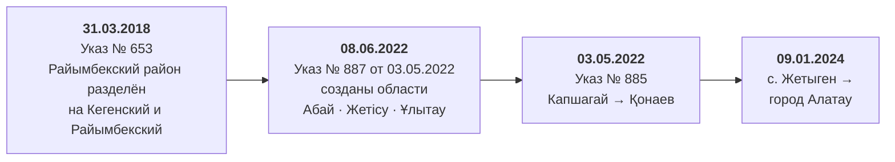

# Территории: версии границ, реформа 2022 года, сопоставление названий

Территориальный костяк — фундамент всей системы. Бюджет, закупки, субсидии,
инфраструктурные проекты привязываются к территории, и если справочник собран
небрежно, ошибка расходится по каждому слою.

Этот документ объясняет три вещи: какие границы используются и почему не те,
что пришли в комплекте; что именно изменила реформа 2022 года и как это влияет
на сопоставимость данных; как система связывает текстовые названия из книг с
записями справочника при полном отсутствии КАТО.

Смежные документы: [источники](source-mapping.md), [модель данных](data-model.md),
[допущения и пробелы](assumptions-and-gaps.md). Первичный аудит —
[`docs/audit/04-geodannye.md`](audit/04-geodannye.md); полное происхождение
используемых наборов — `data/boundaries/PROVENANCE.md`.

---

## 1. Что лежит в базе

| Показатель | Значение |
|---|---:|
| Территорий в справочнике | **32** |
| — страна | 1 |
| — регионы (17 областей + 3 города республиканского значения) | 20 |
| — районы Алматинской области | 9 |
| — города областного значения (Конаев, Алатау) | 2 |
| Геометрий | **31** |
| Версий границ | 2 |
| Алиасов названий | **124** |
| Строк статистики населения | 12 |

Геометрий 31, а не 32: у одной территории полигона нет. Это видимое следствие
того, что границы взяты как есть, а не достроены догадками.

Иерархия: `kz` (страна) → 20 регионов → внутри `almaty-oblast` 9 районов и
2 города.

---

## 2. Версии границ



Нормативная база реформы: **Указ Президента РК № 887 от 3 мая 2022 г.**
«О некоторых вопросах административно-территориального устройства Республики
Казахстан», введён в действие **8 июня 2022 г.**
(https://adilet.zan.kz/rus/docs/U2200000887). Он же перенёс административный
центр Алматинской области из Талдыкоргана в Қонаев.

В базе — две записи `boundary_versions`:

| Код | Объектов | `valid_from` | Источник |
|---|---:|---|---|
| `osm-kz-regions-2026-07-20` | 20 | **2022-06-08** | OSM `admin_level=4` через Overpass API |
| `osm-almaty-oblast-2026-07-20` | 11 | **2024-01-09** | OSM `admin_level=6` внутри области |

Разные даты начала действия не случайны: набор регионов отражает устройство
после Указа № 887, набор единиц Алматинской области — после создания города
Алатау.

Наборов два, потому что **файлов два**: у них разные SHA-256 и разное время
выгрузки. Свести их в одну версию значило бы записать в поле `sha256` хеш одного
файла и выдать его за хеш обоих.

Каждая версия несёт лицензию (**ODbL 1.0**), ссылку на её текст и **дословный
текст атрибуции** — «© OpenStreetMap contributors, ODbL 1.0». Атрибуция хранится
как данные, а не собирается в шаблоне на лету, и кладётся в **тело ответа API**,
а не только в документацию: границы под ODbL нельзя показывать без указания
авторства, и надёжнее отдать его вместе с данными, чем надеяться, что клиент не
забудет.

**Хеш файла сверяется с зафиксированным в PROVENANCE при каждом запуске.** Если
файл изменился, происхождение больше ничего не доказывает, и импорт
останавливается, а не грузит «похожие» данные.

---

## 3. Почему не GADM, который пришёл в комплекте

В комплекте исходников четыре геофайла: `geo-boundaries-kz-master.zip`,
`kz.json`, `kz_1.json`, `kz_2.json`. **Ни один из них не используется.**

Сначала факт, который снимает половину вопросов: `kz_1.json` и `kz_2.json`
**побайтово совпадают** с копиями внутри ZIP (проверено по MD5). Это не
независимые наборы — их источник и есть этот архив. Набор GADM.

### 3.1. Причина первая: устарел на реформу 2022 года

GADM отражает деление **до** реформы. Геометрическая проверка (пересечение
полигонов районов из `kz_2.json` с полигонами регионов из `kz.json`) показала,
что 17 объектов бывшей Алматинской области распадаются так:

| Куда | Объектов |
|---|---:|
| Остались в Алматинской области | 8 |
| Ушли в область Жетісу | 8 |
| Город республиканского значения Алматы | 1 |

Результат **полностью совпал** с перечнем районов из Указа № 887 — две
независимые проверки сошлись.

Та же проверка по всей стране: `East Kazakhstan` (17 районов) → ВКО 8 + Абай 9;
`Qaraghandy` (9) → Карагандинская 7 + Ұлытау 2; `South Kazakhstan` (14) →
Туркестанская 13 + г. Шымкент 1. Остальные 10 областей — 1:1 без изменений.

**Пяти действующих единиц в GADM нет вовсе:**

| Единица | Причина отсутствия |
|---|---|
| Кегенский район | выделен Указом № 653 от 31.03.2018, позже среза GADM 3.6 |
| город Қонаев | бывш. Капшагай; в GADM нет и под старым именем |
| город Алатау | создан в 2024 г. из с. Жетыген Илийского района |
| Ескельдинский район (Жетісу) | отсутствует |
| город Текели (Жетісу) | отсутствует |

`Raiymbekskiy` в GADM (≈ 13 927 км²) — это нынешние Райымбекский и Кегенский
районы вместе.

Отдельная ловушка: **границы двух районов в GADM теперь завышены.** При
создании города Алатау у Илийского района изъято ≈ 64 985 га, у Талгарского —
≈ 12 053 га. Полигоны `Iliyskiy` и `Talgarskiy` эту территорию включают, а
население по ней учтено отдельной строкой «Алатау г.а.» (56 317 чел.). Прямое
деление «население / площадь полигона» по этим двум районам даст заниженную
плотность.

### 3.2. Причина вторая: лицензия

Архив заявляет ODC-PDDL (public domain) — и в `README.md`, и в
`datapackage.json`. Но исходные данные GADM под этой лицензией **не
выпускаются**. Официальная лицензия GADM (проверено 2026-07-20,
https://gadm.org/license.html) гласит:

> «Redistribution or commercial use is not allowed without prior permission»

Публикатор архива не мог перелицензировать чужие данные в public domain.
Практические следствия:

1. Заявление ODC-PDDL в архиве **юридически ненадёжно**, опираться на него
   нельзя.
2. Использование `kz_1.json` / `kz_2.json` в системе для акимата — это, с
   высокой вероятностью, **не** «академическое некоммерческое» использование.
3. Требуется одно из: письменное разрешение GADM; либо замена подложки на
   заведомо свободный источник.

Учитывая, что GADM в любом случае устарел на реформу 2022 года, **замена
источника выбрана как предпочтительная**.

Лицензия `kz.json` (simplemaps) осталась **непроверенной первоисточником**:
прямая проверка страниц simplemaps.com автоматическим запросом невозможна,
сервер отвечает HTTP 403. По результатам поиска базовая бесплатная база
распространяется под CC BY 4.0, но это не подтверждено и подлежит ручной
проверке юристом до публикации.

### 3.3. Что взято вместо

OpenStreetMap через Overpass API, лицензия **ODbL 1.0**, два набора:

| Файл | Объектов | Состав |
|---|---:|---|
| `data/boundaries/kazakhstan-regions-osm.geojson` | 20 | 17 областей + 3 города республиканского значения |
| `data/boundaries/almaty-oblast-osm.geojson` | 12 | область + 11 единиц второго уровня (загружается 11) |

Все три области, созданные реформой 2022 года, присутствуют в OSM как
самостоятельные единицы `admin_level=4`: Абайская (`KZ-10`), Жетысуская
(`KZ-33`), Улутауская (`KZ-62`). Новый город Алатау (`relation/17012094`) тоже
размечен.

Контроль качества геометрий (подробно — в `data/boundaries/PROVENANCE.md`):

| Проверка | Регионы (20) | Алматинская обл. (12) |
|---|---|---|
| `shapely.is_valid` | 20 из 20 | 12 из 12 |
| Перекрытия между единицами | 0.2 км² (0.00001 %) | **0.0 км²** |
| Дыры между соседями | 0.0 км² | **0.0 км²** |
| Сумма частей vs целое | +0.00001 % | +0.01 % |

`relation/215718` (Алматинская область) присутствует **в обоих файлах** — это
один и тот же объект OSM. Он загружается один раз, из набора регионов, а повтор
фиксируется замечанием `duplicate_osm_object` (117 записей в журнале качества),
а не вторым полигоном.

### 3.4. Известные ограничения выбранных наборов

Названы прямо, потому что они влияют на выводы:

1. **Площади включают казахстанский сектор Каспия.** Сумма по OSM —
   2 751 982 км², что примерно на 1 % (≈ 27 тыс. км²) больше общепринятой
   сухопутной площади 2 724 900 км². Полигон Мангистауской области простирается
   до 41.25° с. ш. и 49.81° в. д., Атырауской — до 45.75° с. ш. Границы **не
   обрезались по береговой линии**. При расчёте удельных показателей (расходы
   на км²) по прикаспийским регионам это надо учитывать.
2. **Контур города Алатау не устоялся** — площадь по OSM на 47 % больше
   ориентировочной цифры ведомственного документа.
3. **Полоса 5.8 км² по границе Талгарского района выходит за полигон области** —
   микро-расхождение топологии внутри самого OSM, не исправлялось.
4. **OSM — краудсорсинг.** Полнота и точность не гарантированы, статуса
   официального источника нет. Для юридически значимых задач нужна сверка с
   РГП «Казгеодезия» и приказами об административно-территориальном устройстве.
5. Выгрузка — срез на 2026-07-20; границы в OSM могут измениться.

Расхождение площадей с ведомственным документом фиксируется замечанием
`area_mismatch_with_document` при превышении 5 % — **351 замечание** в базе.
Итог по области при этом сходится: 104 806 км² по OSM против 105 263 км² в
документе (−0.4 %). Топология внутри области идеальна, значит спорной является
линия между соседними районами, а не суммарный контур.

---

## 4. Реформа 2022 года и сопоставимость данных

Рубеж — **8 июня 2022 года**, дата ввода в действие Указа Президента РК № 887 от
3 мая 2022 г.

Что это означает практически:

> До 08.06.2022 «Алматинская область» включала территорию нынешней области
> Жетісу, то есть примерно **вдвое большую площадь**. Суммы по области за
> периоды до и после реформы **несопоставимы напрямую**.

Расчётная площадь по геометрии: «остаток» ≈ 105 500 км², «Жетісу» ≈ 116 800 км²
— согласуется с официальными ≈ 104 тыс. и ≈ 118 тыс. км².

Именно поэтому в схеме заложено версионирование границ (`boundary_versions` с
полем `valid_from`). Без атрибута «на какую дату действует граница» агрегаты по
периодам молча смешивали бы разные территории.

### 4.1. Что реформа сделала с данными книг

Книга 8.3 (бюджет) использует **актуальную** сетку: все три новые области в ней
присутствуют (Абайская REG-001, Жетисуская REG-008, Улытауская REG-017),
«Нур-Султан» отсутствует — используется «г. Астана». Проверено по обоим листам.
Упразднённых единиц в перечне нет.

Книга 8.5 (субсидии) использует **до-реформенную** сетку: из 24 её районов
**11 с 2022 года относятся к области Жетысу**. При джойне с современными
границами это риск двойного счёта, и он назван явно.

Кроме того, **4 территории книги 8.5 лежат вне Алматинской области вовсе**:
Кордайский район, Мойынкумский район, район Ақсуат (Жамбылская и Абай) и
Алатау Г.А. (город Алматы). Полигона на карте Алматинской области у них нет.

### 4.2. Переименования: проверено, их нет

Отдельно проверялись слухи о переименовании двух районов — подтверждения не
найдено, оба сохраняют названия по состоянию на 2026 год:

* **Панфиловский район** (Жетісу) — название действующее.
* **Уйгурский район** (Алматинская) — инициативы 2020 г. (вариант «Қарадала») и
  2022 г. отклонены; в декабре 2024 г. аким области подтвердил, что
  необходимости в переименовании нет.

Единственные изменения состава за 2018–2025 гг. — разделение Райымбекского
района (2018) и создание города Алатау (2024).

Расхождение в написании центра Уйгурского района — **не переименование, а
разноязычие**: в книге населения русская форма «Чунджа», в реестрах акиматов
казахская «Шонжы». То же у Илийского района: «с. Отеген Батыра» против «Өтеген
батыр». Словарь алиасов покрывает обе формы.

---

## 5. КАТО: единственного официального ключа нет

Это, пожалуй, главное ограничение всей территориальной части.

> **КАТО отсутствует как данные во всех шести книгах комплекта. Ни у одного
> района нет кода КАТО ни в одном источнике.**

В геоданных немногим лучше:

| Набор | Тег `kato` |
|---|---|
| `kazakhstan-regions-osm.geojson` (20 регионов) | заполнен у **2 из 20** — Алматинская `190000000`, Карагандинская `350000000` |
| `almaty-oblast-osm.geojson` (11 единиц) | **у 0 из 11** |
| GADM `kz_1.json`, `kz_2.json` | отсутствует полностью |
| Книги 8.3–8.7 | отсутствует полностью |

Коды **не достраивались и не проставлялись вручную** — отсутствие оставлено
видимым (`"kato": null`) и зафиксировано замечанием `kato_missing` (117 записей).
Достроить их можно было бы по справочнику, но справочника КАТО в комплекте нет,
а выдуманный код неотличим от настоящего.

Что используется вместо:

| Уровень | Ключ стыковки | Покрытие |
|---|---|---|
| Регионы (слой 8.3) | **`ISO3166-2`** | 20 из 20 |
| Регионы, резерв | `wikidata` | 20 из 20 |
| Районы (слои 8.4, 8.5, 8.6) | **нормализованное название** через справочник алиасов | см. § 6 |
| Организации (слой 8.7) | нет привязки вовсе | — |

Для стыковки с бюджетными и налоговыми данными за пределами этого комплекта
**потребуется отдельный внешний справочник КАТО**. До ввода системы в
эксплуатацию перечень и коды территорий надо сверить с КАТО: это официальный
ключ, по которому ведутся бюджетные и налоговые данные.

---

## 6. Сопоставление названий

`backend/app/services/territory_resolver.py`. Модуль возник не от хорошей жизни:
раз КАТО нет, единственный способ связать строку книги с территорией — название.
А названия в книгах написаны как придётся:

```
«Талгарский район» · «Талгарский р-н» · «Талгарский»
«Қонаев Г.А.»     · «Конаев»          · «г. Конаев»
«Сарканский»      · «Саркандский»
«Енбекшиказахский» · «Енбекшіқазақский»
```

### 6.1. Свёртка: что снимается, а что нет

Свёртка `normalize_territory_name()` снимает различия, **заведомо не несущие
смысла**:

| Что снимается | Как |
|---|---|
| Казахская графика | `ә→а`, `ғ→г`, `қ→к`, `ң→н`, `ө→о`, `ұ→у`, `ү→у`, `һ→х`, `і→и`, `ё→е` |
| Обозначения типа единицы | `район*`, `аудан*`, `калас*`, `област*`, `обл.`, `р-н`, `г.`, `г.а.`, `с.`, `с.о.`, `город`, `село`, `поселок`, `городская администрация`, `аульный/сельский округ` |
| Регистр | `casefold()` |
| Пунктуация и лишние пробелы | `«»"'\`.,;:()[]/\—–-` → пробел, схлопывание |

**Порядок значим.** Тип единицы снимается **до** удаления пунктуации:
сокращения «р-н», «г.а.», «с.о.» держатся именно на дефисе и точках, и если
сначала вычистить пунктуацию, они распадутся на бессмысленные однобуквенные
слова. Тесты нашли ровно эту ошибку в первой версии свёртки: «р-н» распадалось
на два слова и переставало распознаваться.

Более длинные формы идут раньше коротких, иначе «с.о.» будет съедено правилом
для «с.». Тип снимается по границам слов, поэтому «город» не выкусывается из
«Городовиковский».

**Что свёртка НЕ лечит намеренно:**

> «Сарканский» и «Саркандский» останутся разными строками. Опечатки,
> устаревшие и просто другие названия разрешаются через таблицу алиасов, где у
> каждого написания есть источник.

Причина: правило, склеивающее похожие строки, рано или поздно склеит **разные
территории**. Нечёткого сравнения (расстояние Левенштейна, `SequenceMatcher`) в
резолвере нет вовсе.

### 6.2. Неопознанное название не угадывается

Резолвер возвращает одно из четырёх состояний:

| Статус | Когда | Что дальше |
|---|---|---|
| `resolved` | ровно одно совпадение | `territory_id` проставлен |
| `ambiguous` | написание подходит нескольким территориям | `territory_id = NULL`, замечание |
| `not_found` | написания нет в справочнике | `territory_id = NULL`, замечание |
| `empty` | в источнике пусто | `territory_id = NULL`; это не ошибка сопоставления, а отсутствие данных |

Молча привязать субсидию не к тому району намного хуже, чем показать
пользователю «территория не определена». Неопознанные названия попадают в отчёт
о качестве данных: код `territory_not_resolved`, **110 записей** в базе.

Замечания **группируются по написанию**, а не пишутся построчно: построчная
запись дала бы более двадцати тысяч одинаковых строк за один запуск. Мастеру
импорта нужен список непонятых названий с числом вхождений и примерами строк.
Правило при этом не смягчается.

Резолвер строится из справочника один раз и дальше работает по памяти: импорт
21 521 строки субсидий не должен ходить в базу за каждой строкой.

### 6.3. Таблица алиасов

**124 записи** в `territory_aliases`, четыре вида:

| Вид | Штук | Что это |
|---|---:|---|
| `transliteration` | 59 | Латинские и альтернативные написания |
| `official` | 57 | Официальные названия на русском и казахском |
| `source_spelling` | **6** | Написания источников, включая опечатки — **как есть** |
| `historical` | **2** | Прежние названия |

Полный перечень нетривиальных алиасов:

**Написания источников (`source_spelling`)** — заведены ровно так, как написаны
в книге, и **не исправлены** в данных:

| Алиас (как в источнике) | Указывает на | Характер |
|---|---|---|
| Западно-Казахстан**к**ая область | Западно-Казахстанская область | опечатка (пропущена «с») |
| Северо-Казахстан**к**ая область | Северо-Казахстанская область | опечатка (пропущена «с») |
| Мангы**с**тауская область | Мангистауская область | вариант транслитерации |
| Турк**и**станская область | Туркестанская область | вариант транслитерации |
| Жет**и**суская область | Жетысуская область | расхождение книги и OSM |
| Ул**ы**тауская область | Улутауская область | расхождение книги и OSM |

**Исторические (`historical`)**:

| Алиас | Указывает на | Основание |
|---|---|---|
| Каскеленский район | Карасайский район | прежнее название |
| Қапшағай | Конаев | Указ № 885 от 03.05.2022 |

### 6.4. Два расхождения, где неясно, кто прав

Последние две строки таблицы `source_spelling` заслуживают отдельного слова,
потому что это не опечатки:

* **«Жетисуская» (книга) против «Жетысуская» (OSM).** Официальное русское
  написание — «Жетысуская» (от `Жетісу`), как в OSM. Написание книги
  отклоняется, причём в обеих её колонках — и в исходной, и в «нормализованной».
* **«Улытауская» (книга) против «Улутауская» (OSM).** Здесь, наоборот,
  **сомнителен OSM**. Книга пишет «Улытауская» (от казахского `Ұлытау`), что
  соответствует официальным актам; OSM даёт `name:ru = "Улутауская область"`.

Ни один из вариантов не подменялся. В базе каноническим значением стоит
написание OSM (`Улутауская область`, `Жетысуская область`), а написание книги
сохранено алиасом. Расхождение помечено в секции `warnings` файла
`region-aliases-8-3.json`. Идентификация объектов при этом не вызывает
сомнений: `ISO3166-2 = KZ-62`, `wikidata = Q111830286`.

### 6.5. Единственная реальная неоднозначность

При сопоставлении перечня книги 8.3 с OSM нашлась одна настоящая ничья: «г.
Алматы» даёт score = 1.000 сразу с двумя объектами — городом Алматы (`KZ-75`) и
областью «Алматы облысы» (`KZ-19`), поскольку после снятия слова «облысы» их
казахские названия совпадают.

Снята **формальным признаком, а не догадкой**: строка книги с префиксом «г.»
сопоставляется только с городом республиканского значения, прочие — только с
областями.

**Результат: сопоставлены все 20 из 20 строк книги, взаимно однозначно.** Ни
один регион OSM не остался без строки книги, ни одна строка книги — без региона
OSM. Ручных исключений и «подтягиваний» нет.

По слою 8.5 проверено, что все 24 написания районов сопоставляются однозначно и
ни одно не пересекается с другим.

---

## 7. Сводка непокрытого

| Что | Состояние |
|---|---|
| КАТО | **отсутствует везде**; нужен внешний справочник |
| Границы районов из официального источника | нет; используется OSM с оговоркой о статусе |
| Обрезка полигонов по береговой линии Каспия | не выполнена |
| Лицензия `kz.json` (simplemaps) | не подтверждена первоисточником (HTTP 403) |
| Плотность населения по Илийскому и Талгарскому районам | считать нельзя без корректировки на город Алатау |
| Периоды до 08.06.2022 | несопоставимы с текущими по Алматинской области |
| Территориальная привязка слоя 8.7 | отсутствует в источнике вовсе |
| Привязка слоя 8.6, тип A (ГЧП) | только до уровня области |
